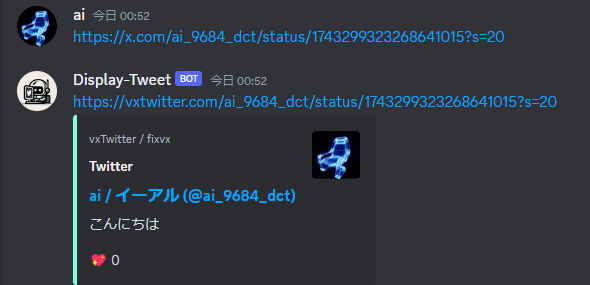

# display-twitter-bot

## Feature

This Discord bot detects Twitter URLs in Discord messages and automatically converts them to vxtwitter.com URLs, enabling thumbnail display on Discord. This feature enhances the visual sharing experience of Twitter content within Discord chats.

## Requirements

Python 3.x
discord.py library
A Discord Bot Token
